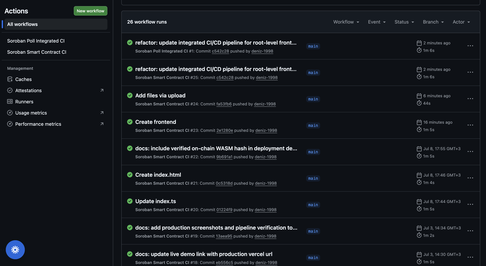

# 🗳️ Soroban Poll Smart Contract & dApp (Level 3)

A production-ready, end-to-end decentralized voting application built on the Stellar network using Soroban smart contracts. This project features advanced contract logic, real-time event streaming, comprehensive unit testing, and a mobile-responsive frontend.

---

##  Submission Links & Details

-- **Live Demo Link:** https://sorosim-ai.vercel.app
- **Demo Video Link:** https://youtu.be/QX6GqxaBPx0
- **Contract Deployment Address:** `CDTHKA53AIM2IB7QN5MIUOUC5RN73KB4Y6JR42XAWCEDY4ZAK3UNZ3FK`
- **WASM Hash / Transaction Ref:** `2dbaa1e058e57827dbd80df3751794b6ca674ba0b51048f07be8c0d171ed4be4`

---

## 📝 Key Features & Requirements Met

* **Advanced Smart Contract Logic:** Built with Rust and Soroban SDK, featuring structured error handling via `PollError` enums.
* **Event Streaming & Real-Time Updates:** Emits real-time cryptographic events (`poll created` and `poll voted`) using `env.events().publish()` for frontend indexing.
* **Automated CI/CD Pipeline:** Fully configured GitHub Actions workflow (`ci.yml`) to automatically trigger on pushes, pulling down the stable Rust toolchain and verifying contract integrity via `cargo test`.


## CI/CD Pipeline Status

Below is the verified GitHub Actions pipeline demonstrating successful automated builds for both the frontend application and the Soroban smart contracts:




* **Mobile Responsive Frontend:** Integrated with Tailwind CSS and Stellar Freighter API for seamless Web3 wallet connections across all viewports.
* **Robust Test Suite:** Features 3+ passing unit tests covering edge cases, invalid options, and successful state mutations.

---

## 🛠️ Local Setup & Execution

### 1. Smart Contract Verification
```bash
cd contracts/soroban-poll-contract
cargo test
